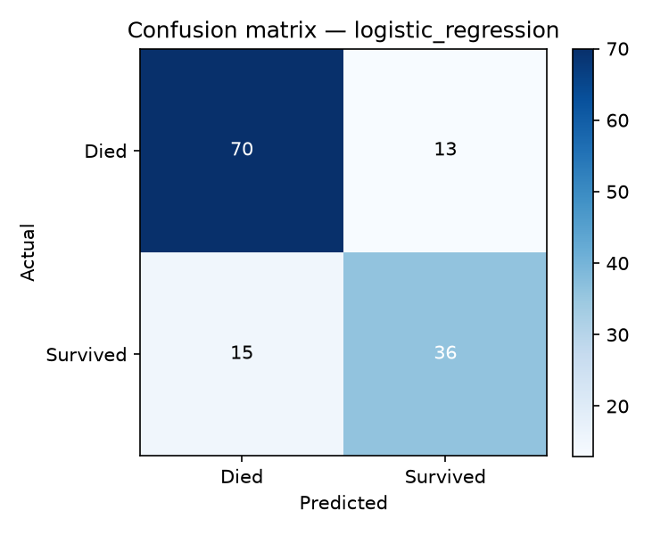

# Week 2 — Model Architecture & Training

**Varolline AI Engineer internship · Week 2** — *Train candidate models,
fine-tune hyperparameters, and measure accuracy and F1 performance.*

Trains three candidate classifiers on the Titanic dataset with
`GridSearchCV` (5-fold CV, F1 scoring) and evaluates each on a held-out
stratified test set (134 passengers).

## Repository layout

```
week2-model-training/
├── data/raw/titanic.csv            # vendored raw data
├── src/
│   ├── preprocessing.py            # Week-1 preprocessing logic (vendored)
│   └── train.py                    # training entry point
├── artifacts/
│   ├── model.joblib                # best full pipeline (preprocessing + classifier)
│   ├── preprocessor.joblib         # fitted preprocessing pipeline alone
│   └── metrics.json                # per-model metrics + winning hyperparameters
├── reports/
│   ├── classification_report.txt
│   └── confusion_matrix.png
├── requirements.txt
├── LICENSE (MIT)
└── README.md
```

## How to run

```bash
python -m venv .venv && source .venv/bin/activate
pip install -r requirements.txt
python src/train.py        # ~40 s on a laptop
```

## Results (test set, n = 134)

| Model | Best hyperparameters | Accuracy | F1 | Precision | Recall | ROC-AUC |
| --- | --- | --- | --- | --- | --- | --- |
| **LogisticRegression ✅** | `C=1.0` | **0.791** | **0.720** | 0.735 | 0.706 | 0.822 |
| RandomForestClassifier | `n_estimators=200, max_depth=10, min_samples_split=5` | 0.769 | 0.674 | 0.727 | 0.628 | 0.822 |
| HistGradientBoostingClassifier | `learning_rate=0.05, max_depth=5, max_iter=100` | 0.776 | 0.681 | 0.744 | 0.628 | 0.823 |

- CV: 5-fold `GridSearchCV`, `scoring="f1"`, `random_state=42`.
- Split protocol matches Week 1 (stratified 70/15/15; train = 623, test = 134).
- LogisticRegression generalises best on this small tabular dataset — the tree
  ensembles overfit slightly (higher CV F1, lower test F1).

## Artifacts

- `artifacts/model.joblib` — the winning end-to-end pipeline; accepts **raw**
  passenger records (same columns as the raw CSV) and returns predictions, so
  Week 3's API can serve it directly.
- `artifacts/preprocessor.joblib` — the fitted preprocessing pipeline alone
  (reused by Week 4's drift monitor).


